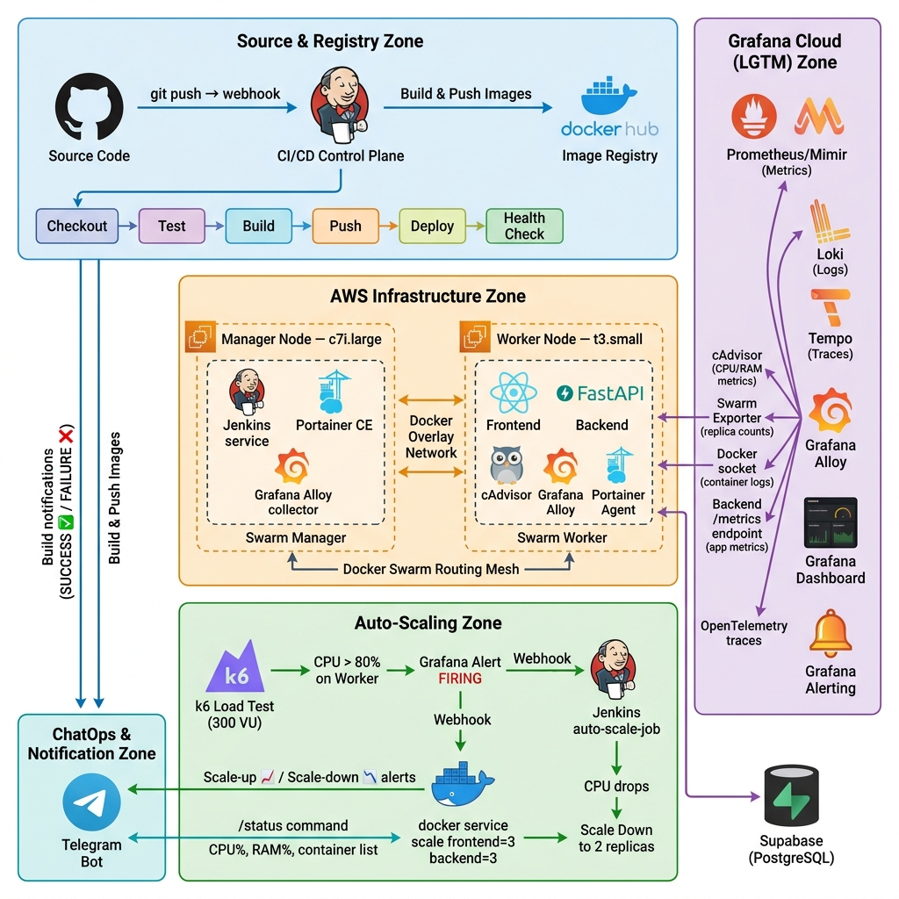

# 🚀 Auto-Deploy Stack — Full-Stack DevOps on Docker Swarm

<p align="center">
  
</p>

<p align="center">
  <a href="https://hub.docker.com/r/toantra349/backend"></a>
  
  
  
  
  
  
  
  
</p>

---

## 📖 Tổng Quan Dự Án

**Auto-Deploy Stack** là một hệ thống DevOps end-to-end, production-ready, triển khai ứng dụng Fullstack (React + FastAPI) trên hạ tầng **Docker Swarm (AWS EC2)** với:

- 🔄 **CI/CD Pipeline tự động hoàn toàn** bằng Jenkins — từ `git push` đến deploy live
- 📈 **Auto-Scaling thông minh** — Grafana Alert → Webhook → Jenkins → `docker service scale`
- 🔭 **Observability Stack đầy đủ (LGTM)** — Metrics, Logs, Traces, Alerting qua Grafana Cloud
- 🤖 **ChatOps via Telegram** — thông báo build, trạng thái hệ thống, kết quả scale real-time
- 🗄️ **Database**: PostgreSQL trên Supabase (managed cloud)

---

## 🏗️ Kiến Trúc Hệ Thống

Hệ thống được chia thành **4 vùng chức năng** chính:

### 1. 🔵 Source & Registry Zone

| Thành phần | Vai trò |
|---|---|
| **GitHub** | Lưu trữ source code, trigger webhook khi `git push` |
| **Jenkins (CI/CD Control Plane)** | Điều phối toàn bộ pipeline: Test → Build → Push → Deploy |
| **Docker Hub** | Image Registry — lưu trữ versioned images (`toantra349/backend:BUILD_NUMBER`) |

**Pipeline flow:**
```
git push → GitHub Webhook → Jenkins
  │
  ├── [Checkout]     Lấy code mới nhất từ SCM
  ├── [Test]         Build multi-stage Docker target "tester" → chạy Pytest
  ├── [Build]        docker compose build (tag theo BUILD_NUMBER)
  ├── [Push]         Push frontend / backend / swarm-exporter lên Docker Hub
  ├── [Deploy]       docker stack deploy → Docker Swarm (rolling update, zero-downtime)
  └── [Health Check] curl /api/health trên Worker Node, retry 3 lần
```

---

### 2. 🟠 AWS Infrastructure Zone (Docker Swarm Cluster)

Cụm Docker Swarm gồm **2 EC2 node**:

#### 🖥️ Manager Node — `c7i.large` (IP: `172.31.2.142`)
| Service | Mô tả |
|---|---|
| `Jenkins` | CI/CD Control Plane, điều phối toàn bộ pipeline |
| `Portainer CE` | Web UI quản lý Docker/Swarm trực quan |
| `Grafana Alloy` | Thu thập metrics + logs từ Manager Node |
| `Swarm Exporter` | Export replica counts (Desired vs Running) lên Prometheus |
| `cAdvisor` | Giám sát CPU/RAM của từng container trên node |

#### 🖥️ Worker Node — `t3.small` (IP: `172.31.95.223`)
| Service | Mô tả |
|---|---|
| `Frontend (React)` | Giao diện người dùng, serve bởi Nginx — Port 80 |
| `Backend (FastAPI)` | REST API + ChatOps + OpenTelemetry Tracing — Port 8000 |
| `cAdvisor` | Giám sát tài nguyên container (chạy global mode) |
| `Grafana Alloy` | Gom logs container qua Docker socket, forward traces |
| `Portainer Agent` | Cho phép Portainer CE quản lý Worker |

**Docker Overlay Network** kết nối hai node qua port `2377`, `7946`, `4789`.
**Docker Swarm Routing Mesh** tự động phân phối traffic giữa các replica.

---

### 3. 🟡 Auto-Scaling Zone

Hệ thống **tự động scale** dựa trên CPU metrics, không cần can thiệp thủ công:

#### Scale-Up Flow (CPU Worker > 80%)
```
k6 Load Test (300 VU)
  → CPU > 80% trên Worker (liên tục 2 phút)
  → Grafana Alert: "CPU High - FIRING"
  → Webhook → Jenkins: auto-scale-job (ACTION=scale-up)
  → docker service scale frontend=3, backend=3
  → Swarm tạo replica mới trên Manager (rảnh hơn)
  → k6 response time ↓ (tải được chia đều)
```

#### Scale-Down Flow (CPU Worker < 30%)
```
k6 giảm tải → CPU < 30% liên tục 5 phút
  → Grafana Alert: "CPU Low - FIRING"
  → Webhook → Jenkins: auto-scale-job (ACTION=scale-down)
  → docker service scale frontend=2, backend=2
  → Telegram thông báo 📉 Scale-Down
```

**Demo timeline:**

| Thời điểm | Sự kiện |
|---|---|
| T+0:00 | k6 khởi động, 100 VU warm-up |
| T+3:00 | 300 VU, CPU Worker tăng mạnh |
| T+5:00 | Grafana Alert → **Pending** |
| T+7:00 | Alert → **Firing** → Webhook tới Jenkins |
| T+7:30 | Jenkins scale lên 3 replicas |
| T+10:00 | 3/3 replicas hoạt động, response time ✅ giảm |
| T+19:00 | CPU < 30% → Scale-Down Alert |
| T+20:00 | Jenkins scale về 2 replicas, Telegram thông báo 📉 |

---

### 4. 🟣 Grafana Cloud (LGTM) Zone

Stack giám sát toàn diện theo chuẩn **LGTM**:

| Thành phần | Dữ liệu thu thập | Nguồn |
|---|---|---|
| **Prometheus/Mimir** | CPU, RAM, Restart Count | cAdvisor (mỗi 15s), Swarm Exporter |
| **Loki** | Container logs (stdout/stderr) | Grafana Alloy → Docker socket |
| **Tempo** | Distributed traces (request tracing) | Backend FastAPI → OpenTelemetry → Alloy |
| **Grafana Dashboard** | Visualize tất cả metrics, logs, traces | Custom Docker Swarm Dashboard |
| **Grafana Alerting** | Alert Rules → Contact Points → Webhook | CPU > 80% / < 30% |

**Grafana Alloy** đóng vai trò Collector trung tâm:
- Scrape metrics từ cAdvisor và Swarm Exporter
- Gom logs qua `docker.sock`
- Nhận OpenTelemetry traces từ Backend (port 4317/4318)
- Forward tất cả lên Grafana Cloud

---

### 5. 💬 ChatOps & Notification Zone

**Telegram Bot** là trung tâm thông báo và điều khiển hệ thống:

| Trigger | Thông báo |
|---|---|
| Build SUCCESS | ✅ `Jenkins Build Alert — #BUILD_NUMBER — SUCCESS + URL` |
| Build FAILURE | ❌ `Jenkins Build Alert — #BUILD_NUMBER — FAILURE + URL` |
| Scale-Up | 📈 Thông báo tự động scale lên N replicas |
| Scale-Down | 📉 Thông báo tự động scale về N replicas |
| `/status` command | CPU%, RAM%, Disk%, danh sách Docker containers |

---

## 🛠️ Tech Stack

| Layer | Công nghệ |
|---|---|
| **Frontend** | React 18, Vite, Nginx |
| **Backend** | FastAPI (Python), Uvicorn, psutil, docker-py |
| **Database** | PostgreSQL (Supabase — managed) |
| **Containerization** | Docker, Docker Compose, Docker Swarm |
| **Image Registry** | Docker Hub (`toantra349/*`) |
| **CI/CD** | Jenkins, Groovy Pipeline (Jenkinsfile) |
| **Infrastructure** | AWS EC2 (c7i.large + t3.small) |
| **Observability** | Grafana Cloud, Grafana Alloy, cAdvisor, Prometheus, Loki, Tempo |
| **Tracing** | OpenTelemetry (OTLP → Alloy → Tempo) |
| **Auto-Scaling** | Grafana Alerting → Webhook → Jenkins → `docker service scale` |
| **Load Testing** | k6 (300 Virtual Users) |
| **ChatOps** | Telegram Bot API |
| **Container Mgmt** | Portainer CE + Agent |

---

## 🚀 Quick Start

### Yêu cầu
- Docker Engine & Docker Compose v2
- Docker Swarm đã khởi tạo (`docker swarm init`)
- File `.env` được cấu hình (xem `.env.example`)
- Grafana Cloud account (cho Observability)

### 1. Clone & Cấu hình

```bash
git clone https://github.com/toantra349/auto-deploy_stack.git
cd auto-deploy_stack

# Sao chép và chỉnh sửa biến môi trường
cp .env.example .env
nano .env
```

### 2. Tạo Swarm Config cho Alloy

```bash
export TAG=1
docker config create alloy_config_v1 config.alloy
```

### 3. Deploy Stack lên Swarm

```bash
export TAG=latest
docker stack deploy --with-registry-auth -c docker-compose.yml auto-deploy_stack
```

### 4. Kiểm tra trạng thái

```bash
# Kiểm tra tất cả services
docker service ls

# Theo dõi replicas real-time
watch -n 5 'docker service ls | grep auto-deploy_stack'

# Health check
curl http://localhost:8000/api/health
```

### 5. Chạy Local Dev (không cần Swarm)

```bash
# Backend
cd backend && python3 -m venv venv && source venv/bin/activate
pip install -r requirements.txt
uvicorn main:app --reload

# Frontend
cd frontend && npm install && npm run dev
```

---

## 🔌 Service Endpoints

| Service | URL | Ghi chú |
|---|---|---|
| Frontend | `http://WORKER_IP:80` | React App |
| Backend API | `http://WORKER_IP:8000` | FastAPI |
| API Health | `http://WORKER_IP:8000/api/health` | Jenkins Health Check |
| API Status (ChatOps) | `http://WORKER_IP:8000/api/status` | CPU/RAM/Containers |
| API Docs | `http://WORKER_IP:8000/docs` | Swagger UI |
| Jenkins | `http://MANAGER_IP:8080` | CI/CD Dashboard |
| Portainer | `http://MANAGER_IP:9000` | Container Management |
| Alloy (gRPC) | `http://WORKER_IP:4317` | OTLP gRPC Tracing |
| Alloy (HTTP) | `http://WORKER_IP:4318` | OTLP HTTP Tracing |

---

## 🔑 API Reference

### `GET /api/health`
Health check endpoint — dùng trong Jenkins pipeline.
```json
{ "status": "ok", "timestamp": "2026-05-13T12:00:00Z" }
```

### `GET /api/status`
Trả về trạng thái server và danh sách container (dùng cho `/status` ChatOps).
```json
{
  "server_status": "running",
  "cpu_percent": 15.2,
  "ram_percent": 42.5,
  "ram_used_mb": 425.3,
  "ram_total_mb": 1000.0,
  "disk_percent": 35.0,
  "containers": [
    { "name": "backend", "status": "running", "image": "toantra349/backend:42" },
    { "name": "frontend", "status": "running", "image": "toantra349/frontend:42" }
  ],
  "docker_status": "connected"
}
```

### `POST /api/hello`
```json
// Request
{ "name": "Toan" }

// Response
{ "message": "Hello Toan", "timestamp": "2026-05-13T12:00:00Z" }
```

---

## ⚙️ Jenkins Pipeline — Chi Tiết

Pipeline được định nghĩa trong `Jenkinsfile` với các stage:

```
┌──────────┐  ┌──────┐  ┌───────────────┐  ┌──────────────────┐  ┌────────┐  ┌──────────────┐
│ Checkout │→ │ Test │→ │ Build Images  │→ │ Push to DockerHub│→ │ Deploy │→ │ Health Check │
└──────────┘  └──────┘  └───────────────┘  └──────────────────┘  └────────┘  └──────────────┘
                                                                                       │
                                                                              ┌────────────────┐
                                                                              │ Telegram Notify│
                                                                              │ (always)       │
                                                                              └────────────────┘
```

| Stage | Kỹ thuật |
|---|---|
| **Test** | Multi-stage Docker build, target `tester` → Pytest |
| **Build** | `TAG=$BUILD_NUMBER docker compose build` |
| **Push** | `docker push toantra349/backend:$TAG` + frontend + swarm-exporter |
| **Deploy** | `docker config create` + `docker stack deploy --with-registry-auth` + `docker system prune` |
| **Health Check** | `curl -f http://WORKER:8000/api/health`, retry 3 lần, timeout 30s |
| **Notify** | Telegram Bot API (Markdown message với status, build number, URL) |

---

## 📊 Load Testing với k6

```bash
# Scale-Up test (HIGH profile — 300 VU)
docker run --rm -i --network host \
  -e PROFILE=high \
  grafana/k6 run - < load_test.js

# Scale-Down test (LOW profile)
docker run --rm -i --network host \
  -e PROFILE=low \
  grafana/k6 run - < load_test.js
```

---

## 📁 Cấu Trúc Thư Mục

```
auto-deploy_stack/
├── 📄 Jenkinsfile              # Main CI/CD pipeline
├── 📄 Jenkinsfile.scale        # Auto-scaling pipeline (scale-up/down)
├── 📄 docker-compose.yml       # Swarm Stack definition (5 services)
├── 📄 config.alloy             # Grafana Alloy collector config
├── 📄 load_test.js             # k6 load test script (300 VU)
├── 📄 .env.example             # Template biến môi trường
├── 🐍 backend/                 # FastAPI application
│   ├── main.py                 # API endpoints + OpenTelemetry
│   ├── requirements.txt
│   └── Dockerfile              # Multi-stage: builder + tester + runtime
├── ⚛️  frontend/               # React + Vite application
│   ├── src/
│   └── Dockerfile              # Multi-stage: build + Nginx serve
├── 📦 swarm-exporter/          # Custom Prometheus exporter (Swarm replicas)
├── 🖼️  image/                  # Architecture diagrams
│   ├── infographics_v2.png     # Sơ đồ kiến trúc tổng quát (v2)
│   └── inforgraphics.png       # Sơ đồ kiến trúc (v1)
└── 📚 docs/                    # Tài liệu chi tiết
    ├── README.md               # (file này)
    ├── PROJECT_OVERVIEW.md     # Tổng quan kiến trúc (Tiếng Việt)
    ├── AUTO_SCALING.md         # Hướng dẫn setup Auto-Scaling từng bước
    ├── CHATOPS.md              # ChatOps /status command docs
    ├── JENKINS_SETUP.md        # Setup Jenkins trên AWS EC2
    ├── OBSERVABILITY_SETUP.md  # Setup Grafana Cloud + Alloy
    ├── SYSTEM_OPERATIONS.md    # Vận hành và troubleshooting
    └── presentation_script.md  # Script thuyết trình demo
```

---

## 📚 Tài Liệu Chi Tiết

| Tài liệu | Mô tả |
|---|---|
| [AUTO_SCALING.md](docs/AUTO_SCALING.md) | Hướng dẫn step-by-step setup Grafana Alert → Jenkins → Scale |
| [CHATOPS.md](docs/CHATOPS.md) | Tính năng `/status` và ChatOps qua Telegram |
| [JENKINS_SETUP.md](docs/JENKINS_SETUP.md) | Cài đặt Jenkins trên EC2, credentials, pipeline setup |
| [OBSERVABILITY_SETUP.md](docs/OBSERVABILITY_SETUP.md) | Cấu hình Grafana Cloud, Alloy, Prometheus, Loki, Tempo |
| [SYSTEM_OPERATIONS.md](docs/SYSTEM_OPERATIONS.md) | Vận hành hàng ngày, troubleshooting, lệnh hữu ích |
| [PROJECT_OVERVIEW.md](docs/PROJECT_OVERVIEW.md) | Tổng quan kiến trúc chi tiết (Tiếng Việt) |

---

## 🔒 Bảo Mật

- **Docker socket**: Mount read-only (`:ro`) — tránh privilege escalation
- **Credentials**: Lưu trong Jenkins Credentials Store (không hardcode)
- **AWS Security Group**: Chỉ mở port cần thiết (80, 8000, 8080 cho Grafana webhook)
- **Swarm Secrets**: Biến nhạy cảm qua `.env` + Jenkins `withCredentials()`
- **Alloy config**: Quản lý qua Docker Swarm Config (versioned theo `$TAG`)

---

## 🗺️ Roadmap

- [ ] **HTTPS / TLS**: Tích hợp Traefik reverse proxy + Let's Encrypt
- [ ] **Multi-node Swarm**: Thêm Worker Node thứ 2 cho HA thực sự
- [ ] **Kubernetes Migration**: Chuyển sang K3s/EKS khi scale > 5 services
- [ ] **AI ChatOps**: Tích hợp LLM để phân tích log tự động và đề xuất fix
- [ ] **Canary Deployment**: Deploy theo phần trăm traffic thay vì rolling toàn bộ
- [ ] **Secret Manager**: AWS Secrets Manager thay thế `.env` file

---

<p align="center">
  Built with ❤️ for the DevOps Community — by <strong>Trần Đức Toàn</strong>
</p>
