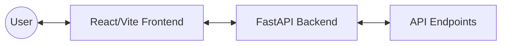

# 🚀 Jenkins CI/CD Pipeline Demo


[](https://reactjs.org/)
[](https://fastapi.tiangolo.com/)
[](https://www.docker.com/)
[](https://vitejs.dev/)
[](https://www.python.org/)

A professional, full-stack demonstration platform engineered for modern **Docker-based CI/CD pipelines**. This project features a high-performance **FastAPI** backend and a premium **React (Vite)** frontend with cinematic background transitions.

---

## ✨ Key Features

- 🎥 **Cinematic UI:** Premium frontend with looping video backgrounds and custom requestAnimationFrame fade logic.
- ⚡ **High Performance:** Lightning-fast API responses powered by FastAPI and Uvicorn.
- 🐳 **Container First:** Fully dockerized architecture with optimized multi-stage builds.
- 🛠️ **Developer Experience:** Hot-reloading enabled for both frontend and backend development.
- 🧪 **Reliable:** Integrated unit testing with Pytest.

---

## 🏗️ Project Architecture



---

## 🚀 Getting Started

### 🐳 The Docker Way (Recommended)

Start the entire stack with a single command:

```bash
docker-compose up --build
```

- **Frontend:** [http://localhost:3000](http://localhost:3000)
- **Backend API:** [http://localhost:8000](http://localhost:8000)
- **API Docs:** [http://localhost:8000/docs](http://localhost:8000/docs)

---

### 🛠️ Local Development

#### ⚛️ Frontend Setup

```bash
cd frontend
npm install
npm run dev
```

#### 🐍 Backend Setup

```bash
cd backend
python3 -m venv venv
source venv/bin/activate
pip install -r requirements.txt
uvicorn main:app --reload
```

---

## 🧪 Testing & Quality

Ensure your backend is running correctly by running the test suite:

```bash
cd backend
pytest
```

---

## 🔗 API Reference

### Greeting Endpoint

`POST /api/hello`

**Request Body:**
```json
{
  "name": "Jane Doe"
}
```

**Successful Response:**
```json
{
  "message": "Hello Jane Doe",
  "timestamp": "2024-05-03T12:00:00.000000Z"
}
```

---

<p align="center">
  Built with ❤️ for the DevOps Community
</p>
# auto-deploy_stack
